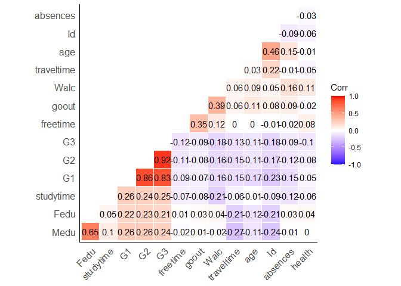
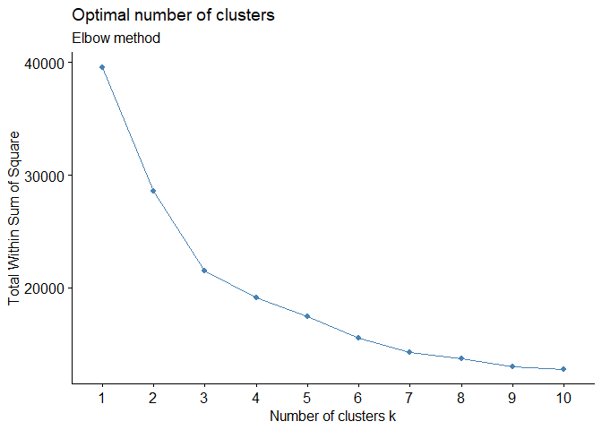
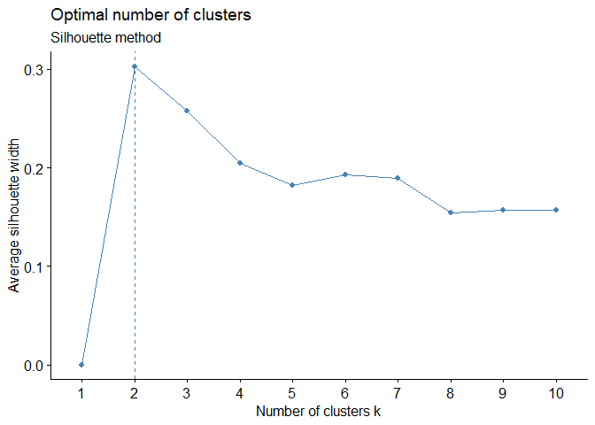
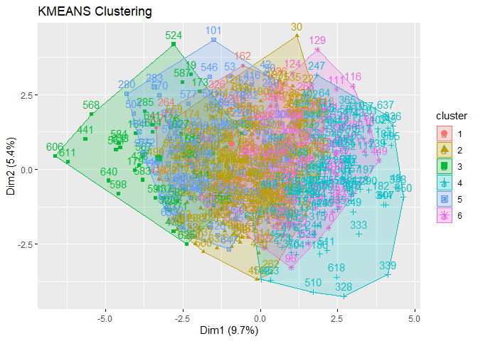
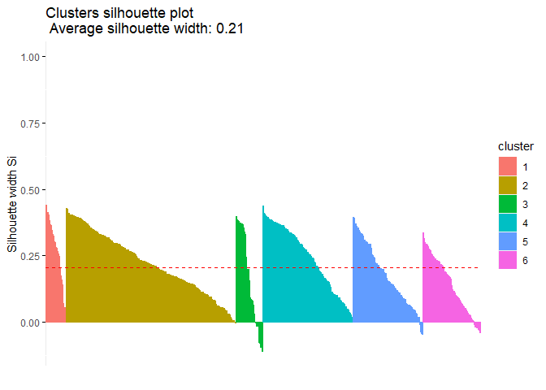
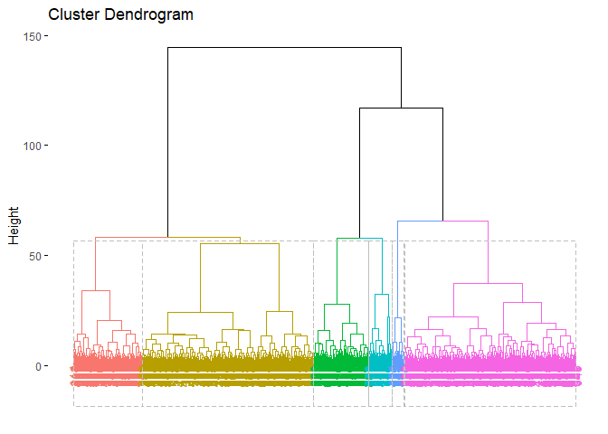
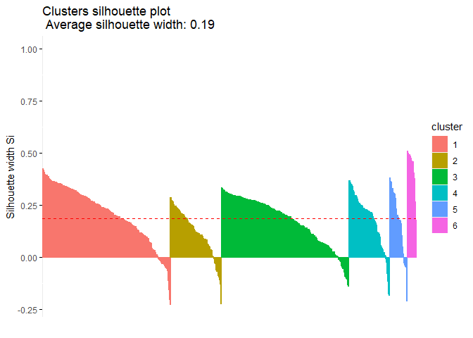
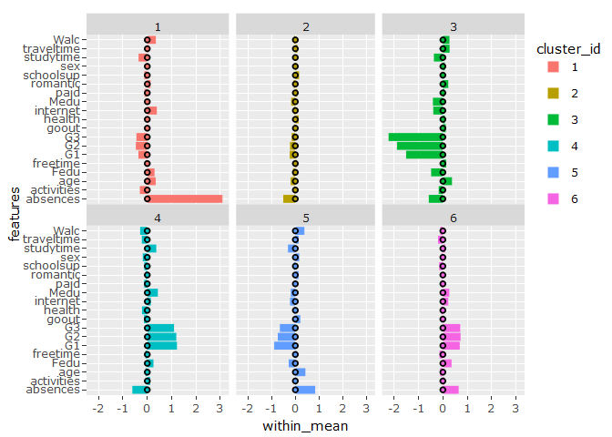

Clustering
================

-   [**Libraries**](#libraries)
-   [**My Functions**](#my-functions)
-   [Environment](#environment)
-   [**EDA**](#eda)
    -   [NA and data types](#na-and-data-types)
    -   [Transform categorial features to continuous
        features](#transform-categorial-features-to-continuous-features)
    -   [Scales continuous features](#scales-continuous-features)
    -   [Correlation](#correlation)
    -   [Final dataset for modeling](#final-dataset-for-modeling)
-   [**Clustering**](#clustering)
    -   [Optimal k](#optimal-k)
    -   [kmeans](#kmeans)
    -   [CAH](#cah)
-   [Hierarchical clustering using Ward
    aggregation](#hierarchical-clustering-using-ward-aggregation)
-   [Descriptive statistics &
    profiling](#descriptive-statistics--profiling)
-   [Export Data with cluster label for supervised
    modeling](#export-data-with-cluster-label-for-supervised-modeling)

# **Libraries**

``` r
library(tidyverse)  # data manipulation
library(cluster)    # clustering algorithms
library(factoextra) # clustering algorithms & visualization
library(dendextend) # for comparing two dendrograms--> Hierarchical Clustering Algorithms
library(Factoshiny) # automate analysis
library(FactoMineR) #unsupervised algorithm
library(plotly)     #dynamic plots
library(writexl)
```

# **My Functions**

``` r
path="C:/Users/u32118508/OneDrive - UPEC/Bureau/Machine_learning_journey/A_journey_in_Machine_Learning/00_functions_clustering.R"
source(path)
```

# Environment

``` r
setwd("C:/Users/u32118508/OneDrive - UPEC/Bureau/Machine_learning_journey/A_journey_in_Machine_Learning/INPUT")
data=dataset=read.table("student-por.csv",sep=";",header=TRUE)
head(data)
```

    ##   school sex age address famsize Pstatus Medu Fedu     Mjob     Fjob     reason
    ## 1     GP   F  18       U     GT3       A    4    4  at_home  teacher     course
    ## 2     GP   F  17       U     GT3       T    1    1  at_home    other     course
    ## 3     GP   F  15       U     LE3       T    1    1  at_home    other      other
    ## 4     GP   F  15       U     GT3       T    4    2   health services       home
    ## 5     GP   F  16       U     GT3       T    3    3    other    other       home
    ## 6     GP   M  16       U     LE3       T    4    3 services    other reputation
    ##   guardian traveltime studytime failures schoolsup famsup paid activities
    ## 1   mother          2         2        0       yes     no   no         no
    ## 2   father          1         2        0        no    yes   no         no
    ## 3   mother          1         2        0       yes     no   no         no
    ## 4   mother          1         3        0        no    yes   no        yes
    ## 5   father          1         2        0        no    yes   no         no
    ## 6   mother          1         2        0        no    yes   no        yes
    ##   nursery higher internet romantic famrel freetime goout Dalc Walc health
    ## 1     yes    yes       no       no      4        3     4    1    1      3
    ## 2      no    yes      yes       no      5        3     3    1    1      3
    ## 3     yes    yes      yes       no      4        3     2    2    3      3
    ## 4     yes    yes      yes      yes      3        2     2    1    1      5
    ## 5     yes    yes       no       no      4        3     2    1    2      5
    ## 6     yes    yes      yes       no      5        4     2    1    2      5
    ##   absences G1 G2 G3
    ## 1        4  0 11 11
    ## 2        2  9 11 11
    ## 3        6 12 13 12
    ## 4        0 14 14 14
    ## 5        0 11 13 13
    ## 6        6 12 12 13

# **EDA**

## NA and data types

``` r
data <- na.omit(data)
sapply(data, class)
```

    ##      school         sex         age     address     famsize     Pstatus 
    ## "character" "character"   "integer" "character" "character" "character" 
    ##        Medu        Fedu        Mjob        Fjob      reason    guardian 
    ##   "integer"   "integer" "character" "character" "character" "character" 
    ##  traveltime   studytime    failures   schoolsup      famsup        paid 
    ##   "integer"   "integer"   "integer" "character" "character" "character" 
    ##  activities     nursery      higher    internet    romantic      famrel 
    ## "character" "character" "character" "character" "character"   "integer" 
    ##    freetime       goout        Dalc        Walc      health    absences 
    ##   "integer"   "integer"   "integer"   "integer"   "integer"   "integer" 
    ##          G1          G2          G3 
    ##   "integer"   "integer"   "integer"

Kmean is not applicable for categorial features

**1st solution** , run the algorithm with just continous fetaure

**2nd solution** ,transform categorial features to continuous

## Transform categorial features to continuous features

<br /> List of non numeric columns.

``` r
colnames(data)[grepl('factor|logical|character',sapply(data,class))]
```

    ##  [1] "school"     "sex"        "address"    "famsize"    "Pstatus"   
    ##  [6] "Mjob"       "Fjob"       "reason"     "guardian"   "schoolsup" 
    ## [11] "famsup"     "paid"       "activities" "nursery"    "higher"    
    ## [16] "internet"   "romantic"

<br /> Let’s run MCA analysis.

``` r
res.MCA<-MCA(data,quanti.sup=c(3,7,8,13,14,15,24,25,26,27,28,29,30,31,32,33),graph=FALSE,ncp=Inf)
res.MCA$eig
```

    ##        eigenvalue percentage of variance cumulative percentage of variance
    ## dim 1  0.12715743               8.314139                          8.314139
    ## dim 2  0.09100529               5.950346                         14.264485
    ## dim 3  0.08262771               5.402581                         19.667067
    ## dim 4  0.07954471               5.201000                         24.868067
    ## dim 5  0.07745900               5.064627                         29.932694
    ## dim 6  0.07408064               4.843734                         34.776428
    ## dim 7  0.07153460               4.677262                         39.453690
    ## dim 8  0.06915592               4.521733                         43.975423
    ## dim 9  0.06632642               4.336727                         48.312150
    ## dim 10 0.06463159               4.225911                         52.538062
    ## dim 11 0.06081557               3.976403                         56.514464
    ## dim 12 0.05823230               3.807496                         60.321961
    ## dim 13 0.05744454               3.755989                         64.077950
    ## dim 14 0.05356159               3.502104                         67.580053
    ## dim 15 0.05080120               3.321617                         70.901670
    ## dim 16 0.04992794               3.264519                         74.166190
    ## dim 17 0.04797190               3.136624                         77.302814
    ## dim 18 0.04614142               3.016939                         80.319753
    ## dim 19 0.04599157               3.007141                         83.326894
    ## dim 20 0.04235051               2.769072                         86.095967
    ## dim 21 0.04068019               2.659859                         88.755825
    ## dim 22 0.03980926               2.602913                         91.358738
    ## dim 23 0.03752946               2.453849                         93.812587
    ## dim 24 0.03454926               2.258990                         96.071578
    ## dim 25 0.03030026               1.981171                         98.052749
    ## dim 26 0.02978149               1.947251                        100.000000

As one would expect the variables the factorial axes fail to summarize
all the information in a very small number of axes. However, this is not
our goal. We recover the coordinates of the individuals on the factorial
axes. <br /> We need column id fore future joint with numeric data

``` r
cat=res.MCA$ind$coord
cat=as.data.frame(cat)
cat$Id  <- 1:nrow(cat)
head(round(cat,2))
```

    ##   Dim 1 Dim 2 Dim 3 Dim 4 Dim 5 Dim 6 Dim 7 Dim 8 Dim 9 Dim 10 Dim 11 Dim 12
    ## 1  0.07 -0.19  0.51  0.05  0.55 -0.74  0.21  0.38 -0.33  -0.05   0.52   0.36
    ## 2  0.10 -0.02  0.19 -0.40 -0.05  0.10 -0.05  0.14 -0.33   0.11  -0.28  -0.23
    ## 3  0.05  0.00  0.41  0.13 -0.09 -0.46 -0.19  0.19  0.17  -0.17   0.18   0.44
    ## 4 -0.42  0.12  0.11 -0.01 -0.08  0.49  0.14  0.23  0.16  -0.24  -0.49   0.14
    ## 5  0.00 -0.20  0.37 -0.34 -0.21 -0.26 -0.09  0.13 -0.11   0.26  -0.25  -0.13
    ## 6 -0.53 -0.01 -0.11  0.32 -0.01  0.08 -0.23 -0.48 -0.01   0.06   0.17   0.01
    ##   Dim 13 Dim 14 Dim 15 Dim 16 Dim 17 Dim 18 Dim 19 Dim 20 Dim 21 Dim 22 Dim 23
    ## 1   0.31   0.25  -0.08   0.51  -0.47  -0.04   0.27   0.10   0.13   0.02   0.12
    ## 2   0.39   0.07   0.11   0.00  -0.01  -0.41   0.24  -0.37  -0.06   0.00   0.07
    ## 3   0.16  -0.38   0.32   0.17   0.29  -0.42   0.56   0.07  -0.24  -0.15  -0.04
    ## 4  -0.23   0.20   0.29   0.16  -0.27   0.21  -0.08   0.42   0.04  -0.22   0.26
    ## 5  -0.24  -0.08   0.01   0.01  -0.30   0.19  -0.21  -0.30  -0.15  -0.01   0.04
    ## 6   0.11  -0.07   0.09  -0.24  -0.08  -0.20  -0.13  -0.07  -0.22  -0.03  -0.12
    ##   Dim 24 Dim 25 Dim 26 Id
    ## 1  -0.11  -0.19  -0.29  1
    ## 2  -0.17  -0.04   0.03  2
    ## 3   0.14  -0.07  -0.01  3
    ## 4   0.06  -0.03   0.12  4
    ## 5   0.08   0.05   0.25  5
    ## 6   0.16   0.13  -0.09  6

## Scales continuous features

Continous features

``` r
numeric_feature<-c("age","absences", "Medu", "Fedu", "freetime", "G1", 
                   "G2","G3" ,"goout" , "health" ,"studytime" ,"traveltime","Walc")
cont<-as.data.frame(scale(data[numeric_feature], center=FALSE, scale=FALSE))
cont$Id  <- 1:nrow(cont)
```

## Correlation

``` r
my_corr(cont)
```

<!-- -->

## Final dataset for modeling

``` r
cont$Id  <- 1:nrow(cont)
input_data<-cat %>%
            inner_join(cont,by='Id') %>%
            dplyr::select(-Id)
```

# **Clustering**

One challenge in clustering is tO determine the otimale number of
cluster. In practice, this step needs feedback between Data Scientist
with Analyst and the Business/Operational teams. Technically, we can
propose the optimale number of cluster via some metrics( elbow,
silhouette, Gap) but to ensure actionability of the clusters, we need to
align with the Business Team.

Another challenge is that in Kmeans and other clustering algorithm is is
to reproduce results. The Solutions to tackle this is :

• Increase number of iteration

• Seet Seed

• Initialize the algorithm with the centers (for optimal output)

## Optimal k

Elbwo Curve

``` r
set.seed(10)
# Elbow method
fviz_nbclust(input_data, kmeans, method = "wss") +
  labs(subtitle = "Elbow method")
```

<!-- -->
K is between 3 an 7 d’après une lecture graphique. Mathematically, we
have built a function which will allow us to choose the k with the right
compromise between intra-class and inter-class inertia. On montre dans
que le k optimale est 5

``` r
 # calculating the within clusters sum-of-squares for 19 cluster amounts
   sum_of_squares = calculate_wcss(input_data)

# calculating the optimal number of clusters
  n = optimal_number_of_clusters(sum_of_squares)
  message("!!!!!optimal number of cluster: ", n)
```

    ## !!!!!optimal number of cluster: 7

Silhouette score

Silhouette Coefficient or silhouette score is a metric used to calculate
the goodness of a clustering technique. Its value ranges from -1 to 1. 1

**score = 1 ** : Means clusters are well apart from each other and
clearly distinguished.

**score =-1** : Means clusters are assigned in the wrong way.

``` r
set.seed(10)
# Silhouette method
fviz_nbclust(input_data, kmeans, method = "silhouette")+
  labs(subtitle = "Silhouette method")
```

<!-- -->
In terms of improving the figure, working with 5 or 4 clusters is the
same thing. ===> Let’s do the analysis with 4 clusters.

## kmeans

``` r
output <- kmeans(input_data, centers = 6, nstart = 25)
output$size
```

    ## [1] 112  17 164 120 204  32

We have 4 clusters with the size above. As it is known that the k mean
is initialized random, no one can assure that the algorithm has
converged. However, we have changed that the kmeans ++ version exists

``` r
library(LICORS)
output2=kmeanspp(input_data, k = 6 , start = "random", iter.max = 100, nstart = 25)
output2$size
```

    ## [1] 204 120 164  32  17 112

Kmean++ give the same output==> the algoritm converges.

``` r
# Enhanced Kmean clustering
res.km <- eclust(x=input_data, 
                 FUN="kmeans",
                 hc_metric = "euclidean" ,
                 k=6)
```

<!-- -->

``` r
#assess silhouette
fviz_silhouette(res.km) 
```

    ##   cluster size ave.sil.width
    ## 1       1   30          0.27
    ## 2       2  254          0.22
    ## 3       3   40          0.16
    ## 4       4  135          0.24
    ## 5       5  104          0.17
    ## 6       6   86          0.14

<!-- -->
Individually, the silhouettes are not negative! good news.

``` r
tmp=res.km$silinfo$widths
filter(tmp, sil_width<0)
```

    ##     cluster neighbor    sil_width
    ## 592       2        4 -0.003410032
    ## 169       3        2 -0.002441276
    ## 437       3        5 -0.012346326
    ## 176       3        5 -0.014260470
    ## 533       3        2 -0.015557704
    ## 429       3        2 -0.016054183
    ## 525       3        2 -0.076068419
    ## 567       3        2 -0.079436651
    ## 178       3        2 -0.082813955
    ## 371       3        2 -0.094820115
    ## 625       3        2 -0.094979334
    ## 455       3        2 -0.108700027
    ## 185       5        2 -0.009296869
    ## 53        5        2 -0.032075349
    ## 474       5        2 -0.036451254
    ## 430       5        2 -0.042641369
    ## 480       5        2 -0.044922345
    ## 405       6        4 -0.008846812
    ## 259       6        4 -0.017915782
    ## 267       6        4 -0.018485416
    ## 266       6        4 -0.021095894
    ## 271       6        4 -0.021470885
    ## 471       6        2 -0.021652803
    ## 418       6        4 -0.028319720
    ## 394       6        4 -0.030168756
    ## 382       6        4 -0.038770604

``` r
#variance explained
message ("variance explained :", res.km$betweenss/res.km$totss)
```

    ## variance explained :0.597509255878817

La séparations des classs explique àpeu près 60 % de la variabilité
totale. Ce qui est synonyme de bon partitionnement.

## CAH

Dissimilarity matrix

``` r
d = dist(input_data, method = "euclidean")
```

# Hierarchical clustering using Ward aggregation

Enhanced hierarchical clustering

``` r
res.hc <- eclust(x=input_data, 
                 FUN="hclust",
                 hc_metric = "euclidean" ,
                 hc_method = "ward.D2",
                 k=6)
```

    ## Warning: `guides(<scale> = FALSE)` is deprecated. Please use `guides(<scale> =
    ## "none")` instead.

``` r
fviz_dend(res.hc, rect = TRUE) 
```

    ## Warning: `guides(<scale> = FALSE)` is deprecated. Please use `guides(<scale> =
    ## "none")` instead.

<!-- -->
Silhouette score assessment

``` r
fviz_silhouette(res.hc) 
```

    ##   cluster size ave.sil.width
    ## 1       1  222          0.21
    ## 2       2   89          0.12
    ## 3       3  221          0.18
    ## 4       4   71          0.18
    ## 5       5   30          0.18
    ## 6       6   16          0.43

<!-- -->

Performance of the partitioning (silhouette) is bad, there are too many
negative values. worse Still: intra-class variance represents only 11%
of the total inertia

``` r
K <- n
ntotal<-dim(input_data)[1]
T <- sum(res.hc$height)
W <- sum(res.hc$height[1:(ntotal-K)])
# E
message ("variance explained :", (1-W/T))
```

    ## variance explained :0.121287484186196

# Descriptive statistics & profiling

Binaries features

``` r
dataset$romantic <- ifelse(dataset$romantic == "yes",1,0)
dataset$internet <- ifelse(dataset$internet == "yes",1,0)
dataset$activities <- ifelse(dataset$activities == "yes",1,0)
dataset$schoolsup <- ifelse(dataset$schoolsup == "yes",1,0)
dataset$paid <- ifelse(dataset$paid == "yes",1,0)
dataset$sex<- ifelse(dataset$sex == "M",1,0)
binary_feature<-c("romantic", "internet", "sex","activities","paid","schoolsup")
```

Create dataset with the cluster number

``` r
output<-dataset[c(binary_feature,numeric_feature)]
output<-data.frame(scale(output))
# create dataset with the cluster number
output$cluster <- (res.km$cluster)
```

Reshape the data

``` r
library(GGally)
```

    ## Registered S3 method overwritten by 'GGally':
    ##   method from   
    ##   +.gg   ggplot2

``` r
temp <- gather(output, key="features", values,-cluster)
head(temp)
```

    ##   cluster features    values
    ## 1       5 romantic -0.762908
    ## 2       2 romantic -0.762908
    ## 3       6 romantic -0.762908
    ## 4       4 romantic  1.308754
    ## 5       2 romantic -0.762908
    ## 6       6 romantic -0.762908

Compute clusers size

``` r
size=output%>%
  group_by(cluster) %>%
  summarise(size=n())
```

Statistics :

L’idée ici est de calculer les moyennes intra classes et la moyenne
inter classe

``` r
grp <- temp %>%
        group_by(cluster, features) %>%
         summarise(within_mean=mean(values),
                   sd=sd(values)) %>%
         ungroup() %>%
         data.frame()
```

    ## `summarise()` has grouped output by 'cluster'. You can override using the `.groups` argument.

``` r
grp=size%>%
   group_by(cluster) %>%
   right_join(grp, by='cluster') %>%
   mutate(w_mean= within_mean *  size / dim(input_data)[1]) %>%
   ungroup() %>%
   group_by(features) %>%
   mutate(between_mean= sum(w_mean)) %>%
  data.frame()

head(grp)
```

    ##   cluster size   features within_mean        sd        w_mean  between_mean
    ## 1       1   30   absences  3.09012480 1.0279784  0.1428408998  2.081668e-17
    ## 2       1   30 activities -0.30395347 0.9585984 -0.0140502373  4.770490e-17
    ## 3       1   30        age  0.34679561 0.9898953  0.0160306138 -1.543904e-16
    ## 4       1   30       Fedu  0.29702571 0.8766964  0.0137300018 -1.144917e-16
    ## 5       1   30   freetime -0.01294908 0.9703395 -0.0005985708  1.588356e-16
    ## 6       1   30         G1 -0.36392678 0.6737093 -0.0168225014  3.261280e-16

Clusters mapping

``` r
grp$cluster_id=factor(grp$cluster)
ggplotly(ggplot(data=grp,aes(y=features, x=within_mean, fill=cluster_id))+
       facet_wrap(~cluster)+
       geom_bar(stat="identity") +
       geom_point(data=grp,aes(x=between_mean, y =features)))
```

<!-- -->
This graph allows us to see how clusters are discriminated by features.

**Cluster 1**: Très Mauvais étudiants agés

Etudiants très agés ayant un nombre d’abscence elévé, mauvaises notes

**Cluster 2**: Etudiants moyen

Jeune étudiant assidu et profil moyen,

**Cluster 3**: Fils à maman

Pas d’abscence, age au dessus de la moyenne, très faible notes + maman
scolarisée + voyages - etudes

**Cluster 4**: Fille travailleuse

Sexe feminin + temps d’études et notes trés élévés (

**Cluster 5**: Garçon étudiants mauvais

Garçons avec peu de temps d’études , abscense peu élévée et faibles
notes.

**Cluster 6**: Abscent mais intelligent et passioné d’ internet

beaucoup internet + notes trés élévés + abscense peu élévée + maman
cadres

# Export Data with cluster label for supervised modeling

``` r
output_df<-dataset[c(binary_feature,numeric_feature)]
output_df$cluster <- (res.km$cluster)
write_xlsx(output_df,"C:/Users/u32118508/OneDrive - UPEC/Bureau/Machine_learning_journey/A_journey_in_Machine_Learning/OUTPUT/output_tp1.xlsx")
```
