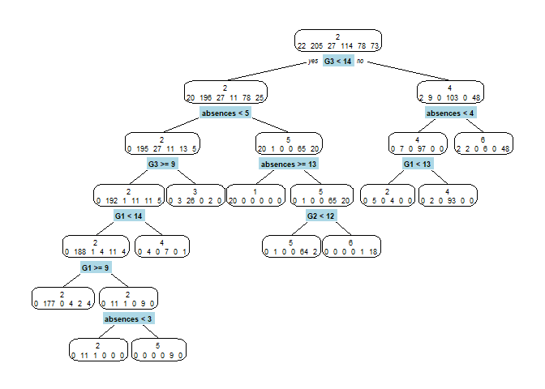
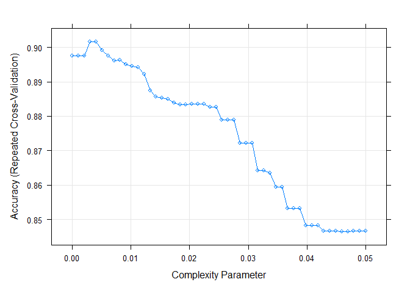
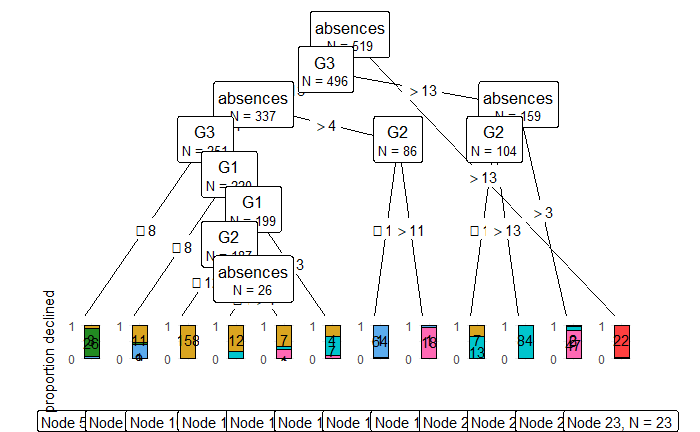
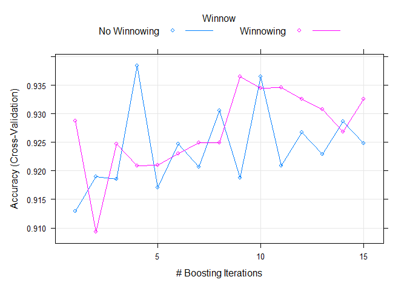

Trees algorithms
================

-   [Libraries](#libraries)
-   [Functions](#functions)
-   [Data](#data)
-   [**CART**](#cart)
    -   [Deep tree](#deep-tree)
    -   [Model assessment](#model-assessment)
-   [**CTREE**](#ctree)
    -   [Fit](#fit)
-   [C50](#c50)
-   [Evaluation du modèle](#evaluation-du-modèle)

# Libraries

``` r
require(caret)  #for easy machine learning workflow
require(MASS)   #for Modern Applied Statistic
require(dplyr)    # alternatively, this also loads 
library(rpart) # (Reursive PARTitioning) 
library(rpart.plot)
library(visNetwork) #customize tree
library(ggparty)    # plot ctree
library(readxl)
library(party)
library(C50)        #c50 tree
```

# Functions

``` r
path="C:/Users/u32118508/OneDrive - UPEC/Bureau/Machine_learning_journey/A_journey_in_Machine_Learning/"
source(paste0(path,"00_functions_tree.R"))
source(paste0(path,"00_functions_multiclass.R"))
```

# Data

``` r
# Load data
data=read_excel(paste0(path,"OUTPUT/output_tp1.xlsx"))

# declare factor features
factor_features<-c("romantic", "internet", "sex","activities","paid","schoolsup","cluster")
data[,factor_features]=data %>%
  dplyr::select(factor_features) %>%
  mutate(across(everything(), as.factor))
```

    ## Note: Using an external vector in selections is ambiguous.
    ## i Use `all_of(factor_features)` instead of `factor_features` to silence this message.
    ## i See <https://tidyselect.r-lib.org/reference/faq-external-vector.html>.
    ## This message is displayed once per session.

``` r
head(data)
```

    ## # A tibble: 6 x 20
    ##   romantic internet sex   activities paid  schoolsup   age absences  Medu  Fedu
    ##   <fct>    <fct>    <fct> <fct>      <fct> <fct>     <dbl>    <dbl> <dbl> <dbl>
    ## 1 0        0        0     0          0     1            18        4     4     4
    ## 2 0        1        0     0          0     0            17        2     1     1
    ## 3 0        1        0     0          0     1            15        6     1     1
    ## 4 1        1        0     1          0     0            15        0     4     2
    ## 5 0        0        0     0          0     0            16        0     3     3
    ## 6 0        1        1     1          0     0            16        6     4     3
    ## # ... with 10 more variables: freetime <dbl>, G1 <dbl>, G2 <dbl>, G3 <dbl>,
    ## #   goout <dbl>, health <dbl>, studytime <dbl>, traveltime <dbl>, Walc <dbl>,
    ## #   cluster <fct>

Partitionnement de données

``` r
set.seed(123)
train.size=0.8
train.index<- sample.int(dim(data)[1],round(dim(data)[1] * train.size ))
train.sample=data[train.index, ]
test.sample=data[-train.index, ]
```

# **CART**

## Deep tree

``` r
cart1 = rpart(cluster~ . ,
              data = train.sample,
              method="class",
              parms=list(split="gini"),
              cp=0)
              # By default :rpart.control(minsplit = 20, minbucket = round(minsplit/3),
prp(cart1,type=2,extra=1,split.box.col="lightblue")
```

<!-- --> ## Prunning

``` r
Cv.cart <- train(cluster~.,data=data,method="rpart",
                 metric="Accuracy",
                 trControl=trainControl(method="repeatedcv",
                                        repeats=50,
                                        number=10),
                 tuneGrid=data.frame(cp=seq(0,0.05,length=50)))

plot(Cv.cart)
```

<!-- --> ## Best fit

``` r
model.cart <- prune(cart1,cp=as.numeric(Cv.cart$best))
prp(model.cart,type=2,extra=1,split.box.col="lightblue")
```

<!-- -->

## Model assessment

``` r
pred.cart_train <- predict(model.cart,train.sample,type="class")
pred.cart_test  <- predict(model.cart,test.sample,type="class")
```

Les performances sur le Train Set

``` r
accuracy_rate(pred.cart_train,  train.sample$cluster)
```

    ## [1] "Accuracy is: 0.92"
    ## [1] "Weighted accuracy is: 0.92"

``` r
F1_rate(pred.cart_train,  train.sample$cluster)
```

    ## [1] "Macro F1 is: 0.92"
    ## [1] "Micro F1 is: 0.96"

Les performances sur le Test Set

``` r
accuracy_rate(pred.cart_test,  test.sample$cluster)
```

    ## [1] "Accuracy is: 0.88"
    ## [1] "Weighted accuracy is: 0.84"

``` r
F1_rate(pred.cart_test,  test.sample$cluster)
```

    ## [1] "Macro F1 is: 0.88"
    ## [1] "Micro F1 is: 0.94"

En comparant les performances du test set et celui du train set, il
semble avoir peu overfitting.Globalement, les resultats sont très bien.

# **CTREE**

## Fit

``` r
model.ctree= ctree(cluster ~., 
                             data = train.sample, 
                             control=ctree_control(mincriterion =0.95, minbucket=10,testtype = "Bonferroni"))
```

How to evaluate the model?

``` r
pred.ctree_train <- predict(model.ctree,train.sample)
pred.ctree_test  <- predict(model.ctree,test.sample)
```

Train Set

``` r
accuracy_rate(pred.ctree_train,  train.sample$cluster)
```

    ## [1] "Accuracy is: 0.9"
    ## [1] "Weighted accuracy is: 0.91"

``` r
F1_rate(pred.ctree_train,   train.sample$cluster)
```

    ## [1] "Macro F1 is: 0.91"
    ## [1] "Micro F1 is: 0.95"

Test Set

``` r
accuracy_rate(pred.ctree_test,   test.sample$cluster)
```

    ## [1] "Accuracy is: 0.86"
    ## [1] "Weighted accuracy is: 0.83"

``` r
F1_rate(pred.ctree_test,   test.sample$cluster)
```

    ## [1] "Macro F1 is: 0.86"
    ## [1] "Micro F1 is: 0.93"

Ce modèle est bon performant par rapport au CART!!!

``` r
 plot_ctree(model.ctree)
```

<!-- -->
# C50

Elagage :a l’effectif du noeud

C5.0 cherche \`a minimiser l’entropie dans les noeuds-fils

C5.0 n’est pas binaire.

``` r
set.seed(1)
c50_grd<-expand.grid(
  .winnow = c(TRUE, FALSE),
  .trials=1:15,
  .model="tree"
)
c50_cv <- train(cluster ~ .,
                data = train.sample,
                method = "C5.0",
                na.action = na.pass,
                trControl = trainControl(method = "cv", number = 10),
                tuneGrid = c50_grd,
                verbose=FALSE)
plot(c50_cv)
```

<!-- -->

``` r
c50_cv$bestTune
```

    ##   trials model winnow
    ## 4      4  tree  FALSE

We should use Winnowing and fix trials to 8.

``` r
model.c50<- C5.0(cluster ~ .,
                 data = train.sample,
                 trials=4,
                 control= C5.0Control(winnow = FALSE))
```

``` r
c50_cv$modelInfo
```

    ## $label
    ## [1] "C5.0"
    ## 
    ## $library
    ## [1] "C50"  "plyr"
    ## 
    ## $loop
    ## function (grid) 
    ## {
    ##     loop <- plyr::ddply(grid, c("model", "winnow"), function(x) c(trials = max(x$trials)))
    ##     submodels <- vector(mode = "list", length = nrow(loop))
    ##     for (i in seq(along = loop$trials)) {
    ##         index <- which(grid$model == loop$model[i] & grid$winnow == 
    ##             loop$winnow[i])
    ##         trials <- grid[index, "trials"]
    ##         submodels[[i]] <- data.frame(trials = trials[trials != 
    ##             loop$trials[i]])
    ##     }
    ##     list(loop = loop, submodels = submodels)
    ## }
    ## <bytecode: 0x0000000029dbdbf0>
    ## 
    ## $type
    ## [1] "Classification"
    ## 
    ## $parameters
    ##   parameter     class                 label
    ## 1    trials   numeric # Boosting Iterations
    ## 2     model character            Model Type
    ## 3    winnow   logical                Winnow
    ## 
    ## $grid
    ## function (x, y, len = NULL, search = "grid") 
    ## {
    ##     if (search == "grid") {
    ##         c5seq <- if (len == 1) 
    ##             1
    ##         else c(1, 10 * ((2:min(len, 11)) - 1))
    ##         out <- expand.grid(trials = c5seq, model = c("tree", 
    ##             "rules"), winnow = c(TRUE, FALSE))
    ##     }
    ##     else {
    ##         out <- data.frame(trials = sample(1:100, replace = TRUE, 
    ##             size = len), model = sample(c("tree", "rules"), replace = TRUE, 
    ##             size = len), winnow = sample(c(TRUE, FALSE), replace = TRUE, 
    ##             size = len))
    ##     }
    ##     out
    ## }
    ## 
    ## $fit
    ## function (x, y, wts, param, lev, last, classProbs, ...) 
    ## {
    ##     theDots <- list(...)
    ##     if (any(names(theDots) == "control")) {
    ##         theDots$control$winnow <- param$winnow
    ##     }
    ##     else theDots$control <- C50::C5.0Control(winnow = param$winnow)
    ##     argList <- list(x = x, y = y, weights = wts, trials = param$trials, 
    ##         rules = param$model == "rules")
    ##     argList <- c(argList, theDots)
    ##     do.call(C50:::C5.0.default, argList)
    ## }
    ## <bytecode: 0x0000000027cac1c8>
    ## 
    ## $predict
    ## function (modelFit, newdata, submodels = NULL) 
    ## {
    ##     out <- predict(modelFit, newdata)
    ##     if (!is.null(submodels)) {
    ##         tmp <- out
    ##         out <- vector(mode = "list", length = nrow(submodels) + 
    ##             1)
    ##         out[[1]] <- tmp
    ##         for (j in seq(along = submodels$trials)) out[[j + 1]] <- as.character(predict(modelFit, 
    ##             newdata, trial = submodels$trials[j]))
    ##     }
    ##     out
    ## }
    ## <bytecode: 0x00000000258b2358>
    ## 
    ## $prob
    ## function (modelFit, newdata, submodels = NULL) 
    ## {
    ##     out <- predict(modelFit, newdata, type = "prob")
    ##     if (!is.null(submodels)) {
    ##         tmp <- vector(mode = "list", length = nrow(submodels) + 
    ##             1)
    ##         tmp[[1]] <- out
    ##         for (j in seq(along = submodels$trials)) {
    ##             tmp[[j + 1]] <- predict(modelFit, newdata, type = "prob", 
    ##                 trials = submodels$trials[j])
    ##         }
    ##         out <- tmp
    ##     }
    ##     out
    ## }
    ## 
    ## $levels
    ## function (x) 
    ## x$obsLevels
    ## 
    ## $predictors
    ## function (x, ...) 
    ## {
    ##     vars <- C50::C5imp(x, metric = "splits")
    ##     rownames(vars)[vars$Overall > 0]
    ## }
    ## 
    ## $varImp
    ## function (object, ...) 
    ## C50::C5imp(object, ...)
    ## 
    ## $tags
    ## [1] "Tree-Based Model"              "Rule-Based Model"             
    ## [3] "Implicit Feature Selection"    "Boosting"                     
    ## [5] "Ensemble Model"                "Handle Missing Predictor Data"
    ## [7] "Accepts Case Weights"         
    ## 
    ## $sort
    ## function (x) 
    ## {
    ##     x$model <- factor(as.character(x$model), levels = c("rules", 
    ##         "tree"))
    ##     x[order(x$trials, x$model, !x$winnow), ]
    ## }
    ## 
    ## $trim
    ## function (x) 
    ## {
    ##     x$boostResults <- NULL
    ##     x$size <- NULL
    ##     x$call <- NULL
    ##     x$output <- NULL
    ##     x
    ## }

``` r
summary(model.c50,trials=4)
```

    ## 
    ## Call:
    ## C5.0.formula(formula = cluster ~ ., data = train.sample, trials = 4, control
    ##  = C5.0Control(winnow = FALSE))
    ## 
    ## 
    ## C5.0 [Release 2.07 GPL Edition]      Sun Dec 26 22:25:02 2021
    ## -------------------------------
    ## 
    ## Class specified by attribute `outcome'
    ## 
    ## Read 519 cases (20 attributes) from undefined.data
    ## 
    ## -----  Trial 0:  -----
    ## 
    ## Decision tree:
    ## 
    ## absences > 4:
    ## :...absences > 13: 1 (23/1)
    ## :   absences <= 13:
    ## :   :...G2 <= 11: 5 (67/3)
    ## :       G2 > 11: 6 (55/1)
    ## absences <= 4:
    ## :...G2 <= 12:
    ##     :...G3 <= 8: 3 (31/5)
    ##     :   G3 > 8:
    ##     :   :...G1 > 8: 2 (172/4)
    ##     :       G1 <= 8:
    ##     :       :...absences <= 3: 2 (11/1)
    ##     :           absences > 3: 5 (9)
    ##     G2 > 12:
    ##     :...absences > 3:
    ##         :...G2 <= 14: 6 (17/3)
    ##         :   G2 > 14: 4 (5/1)
    ##         absences <= 3:
    ##         :...G3 > 13: 4 (99/2)
    ##             G3 <= 13:
    ##             :...G2 > 13: 4 (2)
    ##                 G2 <= 13:
    ##                 :...G1 <= 13: 2 (21/2)
    ##                     G1 > 13: 4 (7/1)
    ## 
    ## -----  Trial 1:  -----
    ## 
    ## Decision tree:
    ## 
    ## absences > 3:
    ## :...G1 > 11: 6 (103.8/28.6)
    ## :   G1 <= 11:
    ## :   :...absences > 13: 1 (12.2)
    ## :       absences <= 13:
    ## :       :...G3 <= 10: 5 (74.5/6.1)
    ## :           G3 > 10: 2 (46.9/19.1)
    ## absences <= 3:
    ## :...G2 > 13: 4 (65.5)
    ##     G2 <= 13:
    ##     :...G2 <= 8: 3 (36/14.1)
    ##         G2 > 8:
    ##         :...G1 <= 12: 2 (124.4/3.8)
    ##             G1 > 12:
    ##             :...G3 <= 12: 2 (14.3)
    ##                 G3 > 12: 4 (41.3/11.4)
    ## 
    ## -----  Trial 2:  -----
    ## 
    ## Decision tree:
    ## 
    ## absences > 5:
    ## :...absences > 13: 1 (25.5/4.7)
    ## :   absences <= 13:
    ## :   :...G3 <= 12: 5 (81.3/16.1)
    ## :       G3 > 12: 6 (34.1)
    ## absences <= 5:
    ## :...G3 <= 12:
    ##     :...G1 > 9: 2 (111.1/3.7)
    ##     :   G1 <= 9:
    ##     :   :...absences <= 3: 2 (44.7/19.3)
    ##     :       absences > 3: 5 (39/11)
    ##     G3 > 12:
    ##     :...G2 > 13: 4 (84.4/10.8)
    ##         G2 <= 13:
    ##         :...absences > 3: 6 (16.1/7.1)
    ##             absences <= 3:
    ##             :...G1 <= 13: 2 (68.9/17.4)
    ##                 G1 > 13: 4 (13.8/1.8)
    ## 
    ## -----  Trial 3:  -----
    ## 
    ## Decision tree:
    ## 
    ## G2 <= 11:
    ## :...absences <= 5:
    ## :   :...G1 <= 8: 3 (70.9/17.6)
    ## :   :   G1 > 8: 2 (122.9/21.4)
    ## :   absences > 5:
    ## :   :...absences <= 13: 5 (49.2)
    ## :       absences > 13: 1 (11.4)
    ## G2 > 11:
    ## :...absences > 3:
    ##     :...absences > 4: 6 (58.1/9.3)
    ##     :   absences <= 4:
    ##     :   :...G1 <= 11: 2 (12.2)
    ##     :       G1 > 11: 6 (47.9/18.8)
    ##     absences <= 3:
    ##     :...G2 > 13: 4 (42.5)
    ##         G2 <= 13:
    ##         :...traveltime > 1: 2 (32.3/1.5)
    ##             traveltime <= 1:
    ##             :...G3 <= 12: 2 (9.9)
    ##                 G3 > 12:
    ##                 :...G2 <= 12: 2 (14.8/3.8)
    ##                     G2 > 12: 4 (43/8.3)
    ## 
    ## 
    ## Evaluation on training data (519 cases):
    ## 
    ## Trial        Decision Tree   
    ## -----      ----------------  
    ##    Size      Errors  
    ## 
    ##    0     13   24( 4.6%)
    ##    1      9   82(15.8%)
    ##    2     10   69(13.3%)
    ##    3     12   58(11.2%)
    ## boost             19( 3.7%)   <<
    ## 
    ## 
    ##     (a)   (b)   (c)   (d)   (e)   (f)    <-classified as
    ##    ----  ----  ----  ----  ----  ----
    ##      22                                  (a): class 1
    ##           204           1                (b): class 2
    ##             2    22           3          (c): class 3
    ##             3         109           2    (d): class 4
    ##             3                74     1    (e): class 5
    ##       1                 1     2    69    (f): class 6
    ## 
    ## 
    ##  Attribute usage:
    ## 
    ##  100.00% absences
    ##  100.00% G2
    ##   95.57% G3
    ##   83.43% G1
    ##   17.53% traveltime
    ## 
    ## 
    ## Time: 0.0 secs

# Evaluation du modèle

``` r
pred.c50_train <- predict(model.c50,train.sample)
pred.c50_test  <- predict(model.c50,test.sample)
```

Train Set

``` r
accuracy_rate(pred.c50_train,  train.sample$cluster)
```

    ## [1] "Accuracy is: 0.96"
    ## [1] "Weighted accuracy is: 0.94"

``` r
F1_rate(pred.c50_train,   train.sample$cluster)
```

    ## [1] "Macro F1 is: 0.95"
    ## [1] "Micro F1 is: 0.98"

Waouh!!!!!! Je viens d’avoir les performances les plus élévées.

Cela n’est pas aussi étonnant vu que le nombre de trials=4.

Mais avant de se prononcer, les performances sur les données de test
doivent etre inspectées.

Test Set

``` r
accuracy_rate(pred.c50_test,   test.sample$cluster)
```

    ## [1] "Accuracy is: 0.9"
    ## [1] "Weighted accuracy is: 0.86"

``` r
F1_rate(pred.c50_test,   test.sample$cluster)
```

    ## [1] "Macro F1 is: 0.9"
    ## [1] "Micro F1 is: 0.95"

Par rapport aux autres modèles, les métriques du C50 sont plus élévées.

En définitive C50 est la meilleure option.
