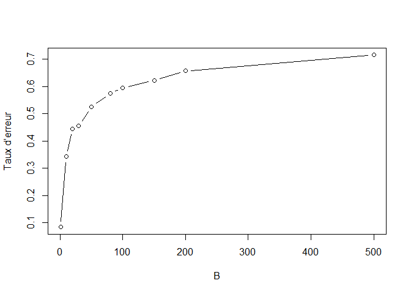

Ensemble methods : BAGGING
================

-   [My functions](#my-functions)
-   [Libraries](#libraries)
-   [Data](#data)
-   [Bagging](#bagging)
    -   [Nice to know!!](#nice-to-know)
    -   [Models](#models)

The purpose of this notebook is to measure the quality of the work
carried out in the clustering part. The more stable our clustering is,
the more we will be able to find good ranking. We’ll use cart bagged
(short for bootstrap aggregation)

# My functions

``` r
source("C:/Users/u32118508/OneDrive - UPEC/Bureau/Machine_learning_journey/Machine_learning_journey/00_functions_multiclass.R")
```


# Libraries

``` r
library(tidyverse) #for easy data manipulation and visua
library(caret)  #for easy machine learning workflow
library(readxl) # Load the data
library(caret)
library(rpart)
library(adabag)
```

``` r
data=read_excel("C:/Users/u32118508/OneDrive - UPEC/Bureau/Machine_learning_journey/Machine_learning_journey/OUTPUT/output_tp1.xlsx")
head(data)
```

    ## # A tibble: 6 x 20
    ##   romantic internet   sex activities  paid schoolsup   age absences  Medu  Fedu
    ##      <dbl>    <dbl> <dbl>      <dbl> <dbl>     <dbl> <dbl>    <dbl> <dbl> <dbl>
    ## 1        0        0     0          0     0         1    18        4     4     4
    ## 2        0        1     0          0     0         0    17        2     1     1
    ## 3        0        1     0          0     0         1    15        6     1     1
    ## 4        1        1     0          1     0         0    15        0     4     2
    ## 5        0        0     0          0     0         0    16        0     3     3
    ## 6        0        1     1          1     0         0    16        6     4     3
    ## # ... with 10 more variables: freetime <dbl>, G1 <dbl>, G2 <dbl>, G3 <dbl>,
    ## #   goout <dbl>, health <dbl>, studytime <dbl>, traveltime <dbl>, Walc <dbl>,
    ## #   cluster <dbl>

Split the data into training (80%) and test set (20%)

``` r
set.seed(123)
train.size=0.8
train.index<- sample.int(dim(data)[1],round(dim(data)[1] * train.size ))
train.sample=data[train.index, ]
test.sample=data[-train.index, ]
```

# Bagging

## Nice to know!!

-   **Interest of cooperation** : Making models cooperate is only of
    interest if the models do not all classify in the same way (if the
    vote is systematically unanimous, we might as well have only one
    model)

-   **Bias and variance** : Bagging primarily reduces variance. but deep
    trees are lows biais .Models have a weak bias, capturing the
    complexity of the relationships between y and X.

-   **Weak learners** : Bagging does not know how to take advantage of
    weak learners. The underlying models must be in good quality.

-   **Overfitting**. : Increasing B (number of tree) does not lead to
    overfitting. In practice, a hundred is enough, but it can be
    adjusted via Cross validation.

-   **Why with Decision trees** : Bagging can be applied to any type of
    model. But trees are particularly advantageous because we can reduce
    the individual bias non-pruned trees . Also baggin can Reduce the
    variance by the mechanism of cooperation

-   **Possibilit to do Parralelization in computing**

## Models

Here, the parameters to tune is the number of tree (nbaag)

``` r
# nbagg
B<-c(1,10,20,30,50,80,100, 150,200,500)
# bagging model for each nbagg
une_session <- function(b){ 
  
model.bagging <-train(cluster~ .,
                    data = train.sample, 
                    method = "treebag",
                    nbagg = b,  
                      control = rpart.control(minsplit = 2, cp = 0))


p.bagging <-predict(model.bagging,newdata=test.sample)

return(mean(test.sample$cluster!=p.bagging)) 
}
# replicate 
errors<-replicate(5,sapply(B,une_session)) 
m.errors <- apply(errors,1,mean)
plot(B,m.errors,xlab='B',ylab='Taux d’erreur',type='b')
```

<!-- -->
Visiblement, pour B=0 nous avons le taux d’erreur la plus basse. Donc,
il n y a aucun intéret à appliquer un modèl bagging cart!!!
