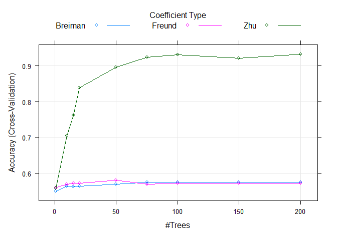
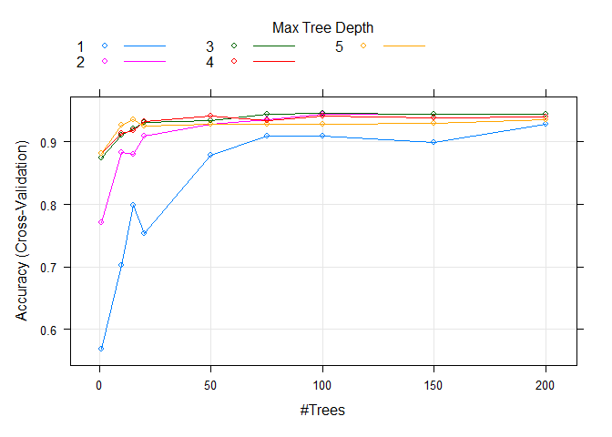
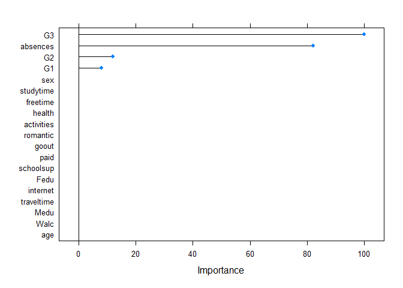

Ensemble methods : BOOSTING
================

-   [Nice to know](#nice-to-know)
-   [Parameters tunning](#adaboostm1-parameters-tunning)
-   [Data](#data)
-   [Variables importance](#variables-importance)

# Nice to know

1.  Always learn about different versions of the data. But better manage
    learning by focusing on individuals misclassified in the previous
    step.

2.  Weak learners: Model that does best than a random assignment.
    Boosting. Combining weak learners in an appropriate way produces a
    model efficient, significantly better than each model taken
    individually.

3.  individuals Weighting of . In step (b + 1), the idea is to give a
    higher weighting to individuals misclassified by Mb

4.  Bias and variance. In orientation, learning at each stage, boosting
    acts on the bias; in them combining, it acts on the variance.

5.  overfitting Increasing B does not lead to over-learning

If we want to use ADABOOST.M1 for mutliclassification, we need to
specify SAMME and Zhu coefficient learner

We can limit the strategy to simple “decision stumps” (tree with only
one segmentation) which have a strong bias but a very low variance.

# ADABOOST.M1 Parameters tunning

``` r
# Libraries
```

``` r
library(tidyverse) #for easy data manipulation and visualization
```

    ## -- Attaching packages --------------------------------------- tidyverse 1.3.1 --

    ## v ggplot2 3.3.5     v purrr   0.3.4
    ## v tibble  3.1.6     v dplyr   1.0.7
    ## v tidyr   1.1.4     v stringr 1.4.0
    ## v readr   2.1.0     v forcats 0.5.1

    ## -- Conflicts ------------------------------------------ tidyverse_conflicts() --
    ## x dplyr::filter() masks stats::filter()
    ## x dplyr::lag()    masks stats::lag()

``` r
library(caret)  #for easy machine learning workflow
```

    ## Le chargement a nécessité le package : lattice

    ## 
    ## Attachement du package : 'caret'

    ## L'objet suivant est masqué depuis 'package:purrr':
    ## 
    ##     lift

``` r
library(readxl) # Load the data
library(caret)
library(rpart)
library(adabag)
```

    ## Le chargement a nécessité le package : foreach

    ## 
    ## Attachement du package : 'foreach'

    ## Les objets suivants sont masqués depuis 'package:purrr':
    ## 
    ##     accumulate, when

    ## Le chargement a nécessité le package : doParallel

    ## Le chargement a nécessité le package : iterators

    ## Le chargement a nécessité le package : parallel

# Data

``` r
data=read_excel("C:/Users/u32118508/OneDrive - UPEC/Bureau/Machine_learning_journey/Machine_learning_journey/OUTPUT/output_tp1.xlsx")
head(data)
```

    ## # A tibble: 6 x 20
    ##   romantic internet   sex activities  paid schoolsup   age absences  Medu  Fedu
    ##      <dbl>    <dbl> <dbl>      <dbl> <dbl>     <dbl> <dbl>    <dbl> <dbl> <dbl>
    ## 1        0        0     0          0     0         1    18        4     4     4
    ## 2        0        1     0          0     0         0    17        2     1     1
    ## 3        0        1     0          0     0         1    15        6     1     1
    ## 4        1        1     0          1     0         0    15        0     4     2
    ## 5        0        0     0          0     0         0    16        0     3     3
    ## 6        0        1     1          1     0         0    16        6     4     3
    ## # ... with 10 more variables: freetime <dbl>, G1 <dbl>, G2 <dbl>, G3 <dbl>,
    ## #   goout <dbl>, health <dbl>, studytime <dbl>, traveltime <dbl>, Walc <dbl>,
    ## #   cluster <dbl>

Split the data into training (80%) and test set (20%)

``` r
set.seed(123)
train.size=0.8
train.index<- sample.int(dim(data)[1],round(dim(data)[1] * train.size ))
train.sample=data[train.index, ]
test.sample=data[-train.index, ]
```

How many stump do wee to create

``` r
library(adabag)
set.seed(1)


#boosting avec 100 decision stump
cctrl <- trainControl(method = "cv",
                      number = 10,
                      classProbs = TRUE
)


grid <- expand.grid(mfinal = c(1,10,15,20,50, 75,100,150,200),
                    coeflearn = c("Breiman", "Freund", "Zhu"),
                    maxdepth=1)


stump.training  <- train(y=make.names(train.sample$cluster), 
                         x=train.sample[,-20] ,
                             method = "AdaBoost.M1", 
                             trControl = cctrl,
                             tuneGrid = grid,
                             metric = "Accuracy")
```

    
``` r
plot(stump.training )
```

<!-- --> Let see
how this algorithm fits the data Comme prévu Zhu est la bonne
spécification car nous sommes dans un cas de multicalssification,!!

``` r
train.stump.pred<-predict(stump.training,newdata=train.sample)
test.stump.pred<-predict(stump.training,newdata=test.sample)
```

``` r
confusionMatrix(train.stump.pred,factor(paste0("X",(factor(train.sample$cluster)))))
```

    ## Confusion Matrix and Statistics
    ## 
    ##           Reference
    ## Prediction  X1  X2  X3  X4  X5  X6
    ##         X1  22   0   0   0   0   1
    ##         X2   0 205   6   9   5   0
    ##         X3   0   0  18   0   0   0
    ##         X4   0   0   0  99   0   0
    ##         X5   0   0   3   0  73   2
    ##         X6   0   0   0   6   0  70
    ## 
    ## Overall Statistics
    ##                                           
    ##                Accuracy : 0.9383          
    ##                  95% CI : (0.9141, 0.9574)
    ##     No Information Rate : 0.395           
    ##     P-Value [Acc > NIR] : < 2.2e-16       
    ##                                           
    ##                   Kappa : 0.9167          
    ##                                           
    ##  Mcnemar's Test P-Value : NA              
    ## 
    ## Statistics by Class:
    ## 
    ##                      Class: X1 Class: X2 Class: X3 Class: X4 Class: X5
    ## Sensitivity            1.00000    1.0000   0.66667    0.8684    0.9359
    ## Specificity            0.99799    0.9363   1.00000    1.0000    0.9887
    ## Pos Pred Value         0.95652    0.9111   1.00000    1.0000    0.9359
    ## Neg Pred Value         1.00000    1.0000   0.98204    0.9643    0.9887
    ## Prevalence             0.04239    0.3950   0.05202    0.2197    0.1503
    ## Detection Rate         0.04239    0.3950   0.03468    0.1908    0.1407
    ## Detection Prevalence   0.04432    0.4335   0.03468    0.1908    0.1503
    ## Balanced Accuracy      0.99899    0.9682   0.83333    0.9342    0.9623
    ##                      Class: X6
    ## Sensitivity             0.9589
    ## Specificity             0.9865
    ## Pos Pred Value          0.9211
    ## Neg Pred Value          0.9932
    ## Prevalence              0.1407
    ## Detection Rate          0.1349
    ## Detection Prevalence    0.1464
    ## Balanced Accuracy       0.9727

``` r
confusionMatrix(test.stump.pred,factor(paste0("X",(factor(test.sample$cluster)))))
```

    ## Confusion Matrix and Statistics
    ## 
    ##           Reference
    ## Prediction X1 X2 X3 X4 X5 X6
    ##         X1  8  0  0  0  0  0
    ##         X2  0 49  4  2  2  2
    ##         X3  0  0  9  0  0  0
    ##         X4  0  0  0 15  0  0
    ##         X5  0  0  0  0 23  0
    ##         X6  0  0  0  4  1 11
    ## 
    ## Overall Statistics
    ##                                          
    ##                Accuracy : 0.8846         
    ##                  95% CI : (0.8168, 0.934)
    ##     No Information Rate : 0.3769         
    ##     P-Value [Acc > NIR] : < 2.2e-16      
    ##                                          
    ##                   Kappa : 0.8465         
    ##                                          
    ##  Mcnemar's Test P-Value : NA             
    ## 
    ## Statistics by Class:
    ## 
    ##                      Class: X1 Class: X2 Class: X3 Class: X4 Class: X5
    ## Sensitivity            1.00000    1.0000   0.69231    0.7143    0.8846
    ## Specificity            1.00000    0.8765   1.00000    1.0000    1.0000
    ## Pos Pred Value         1.00000    0.8305   1.00000    1.0000    1.0000
    ## Neg Pred Value         1.00000    1.0000   0.96694    0.9478    0.9720
    ## Prevalence             0.06154    0.3769   0.10000    0.1615    0.2000
    ## Detection Rate         0.06154    0.3769   0.06923    0.1154    0.1769
    ## Detection Prevalence   0.06154    0.4538   0.06923    0.1154    0.1769
    ## Balanced Accuracy      1.00000    0.9383   0.84615    0.8571    0.9423
    ##                      Class: X6
    ## Sensitivity            0.84615
    ## Specificity            0.95726
    ## Pos Pred Value         0.68750
    ## Neg Pred Value         0.98246
    ## Prevalence             0.10000
    ## Detection Rate         0.08462
    ## Detection Prevalence   0.12308
    ## Balanced Accuracy      0.90171

We go from precision = 94% to 88% in the test set!

The metrics in both datasets aren’t great compared to the previous
models we saw on this trip !!

Adaboost with decision strains is no better than a linear model!

Not better than trees models also.

``` r
grid2 <- expand.grid(mfinal = c(1,10,15,20,50, 75,100,150,200),
                    coeflearn = "Zhu",
                    maxdepth=1:5)

cctrl <- trainControl(method = "cv",
                      number = 10,
                      classProbs = TRUE
)


nostump.training  <- train(y=make.names(train.sample$cluster), 
                         x=train.sample[,-20] ,
                             method = "AdaBoost.M1", 
                             trControl = cctrl,
                             tuneGrid = grid2,
                             metric = "Accuracy")
```

    
``` r
plot(nostump.training )
```

<!-- -->

``` r
test.nostump.pred<-predict(nostump.training,newdata=test.sample)

confusionMatrix(test.stump.pred,factor(paste0("X",(factor(test.sample$cluster)))))
```

    ## Confusion Matrix and Statistics
    ## 
    ##           Reference
    ## Prediction X1 X2 X3 X4 X5 X6
    ##         X1  8  0  0  0  0  0
    ##         X2  0 49  4  2  2  2
    ##         X3  0  0  9  0  0  0
    ##         X4  0  0  0 15  0  0
    ##         X5  0  0  0  0 23  0
    ##         X6  0  0  0  4  1 11
    ## 
    ## Overall Statistics
    ##                                          
    ##                Accuracy : 0.8846         
    ##                  95% CI : (0.8168, 0.934)
    ##     No Information Rate : 0.3769         
    ##     P-Value [Acc > NIR] : < 2.2e-16      
    ##                                          
    ##                   Kappa : 0.8465         
    ##                                          
    ##  Mcnemar's Test P-Value : NA             
    ## 
    ## Statistics by Class:
    ## 
    ##                      Class: X1 Class: X2 Class: X3 Class: X4 Class: X5
    ## Sensitivity            1.00000    1.0000   0.69231    0.7143    0.8846
    ## Specificity            1.00000    0.8765   1.00000    1.0000    1.0000
    ## Pos Pred Value         1.00000    0.8305   1.00000    1.0000    1.0000
    ## Neg Pred Value         1.00000    1.0000   0.96694    0.9478    0.9720
    ## Prevalence             0.06154    0.3769   0.10000    0.1615    0.2000
    ## Detection Rate         0.06154    0.3769   0.06923    0.1154    0.1769
    ## Detection Prevalence   0.06154    0.4538   0.06923    0.1154    0.1769
    ## Balanced Accuracy      1.00000    0.9383   0.84615    0.8571    0.9423
    ##                      Class: X6
    ## Sensitivity            0.84615
    ## Specificity            0.95726
    ## Pos Pred Value         0.68750
    ## Neg Pred Value         0.98246
    ## Prevalence             0.10000
    ## Detection Rate         0.08462
    ## Detection Prevalence   0.12308
    ## Balanced Accuracy      0.90171

Even if we build trees a little deep, we do not gain any performance
improvements.

## Variables importance

How is compte features importance in boosting methods?

sum of the contributions of the variables in each tree weighted by the
importance of the tree This method uses the same approach as a single
tree, but sums the importances over each boosting iteration

``` r
VI <- varImp(stump.training, scale = TRUE)
plot(VI)
```

<!-- -->
