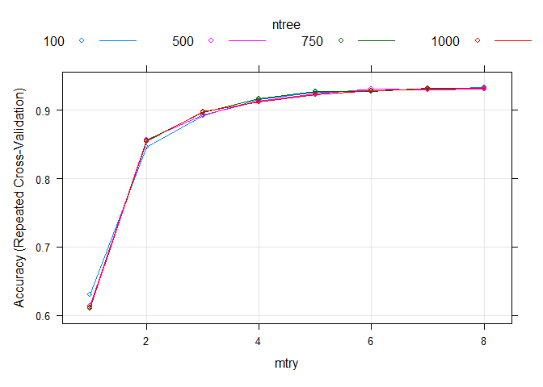
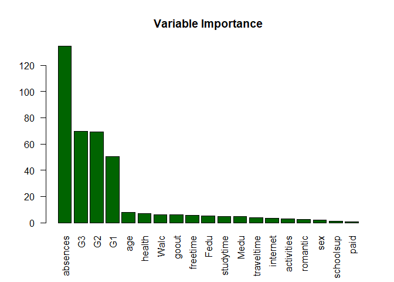

Ensemble methods : RANDOM FOREST
================

-   [Libraries](#libraries)
-   [Nice to know](#nice-to-know)
-   [Data](#data)
-   [Parameters tunning](#parameters-tunning)
-   [Goodness of fit](#goodness-of-fit)
-   [Features importance](#features-importance)

# Libraries

``` r
library(tidyverse) #for easy data manipulation and visualization
library(caret)  #for easy machine learning workflow
library(readxl) # Load the data
library(caret)
library(rpart)
library(randomForest)
```

# Nice to know

For bagging to be effective, you must have:

1.  That the trees are individually efficient

2.  High depth (low bias) - Min. leaves = 1

3.  And above all, very strongly different from each other so that they
    can complement each other. Notion of “No correlation” of trees.

So, RF Introduce a “random” noise in the construction of trees, by
playing on the variable selection mechanism.

We have to parameters to tune :

**mtry**: Number of variables randomly sampled as candidates at each split.

**ntree**: Number of trees to grow.The default value is p/3 for regression
and sqrt(p) for classification.We should avoid using smaller values of
mtry to avoid overfitting.

**nodesize** – It refers to how many observations we want in the terminal
nodes. If we use cart, we don’t need to tune it!:::::

# Data

``` r
data=read_excel("C:/Users/u32118508/OneDrive - UPEC/Bureau/Machine_learning_journey/Machine_learning_journey/OUTPUT/output_tp1.xlsx")
head(data)
```

    ## # A tibble: 6 x 20
    ##   romantic internet   sex activities  paid schoolsup   age absences  Medu  Fedu
    ##      <dbl>    <dbl> <dbl>      <dbl> <dbl>     <dbl> <dbl>    <dbl> <dbl> <dbl>
    ## 1        0        0     0          0     0         1    18        4     4     4
    ## 2        0        1     0          0     0         0    17        2     1     1
    ## 3        0        1     0          0     0         1    15        6     1     1
    ## 4        1        1     0          1     0         0    15        0     4     2
    ## 5        0        0     0          0     0         0    16        0     3     3
    ## 6        0        1     1          1     0         0    16        6     4     3
    ## # ... with 10 more variables: freetime <dbl>, G1 <dbl>, G2 <dbl>, G3 <dbl>,
    ## #   goout <dbl>, health <dbl>, studytime <dbl>, traveltime <dbl>, Walc <dbl>,
    ## #   cluster <dbl>

Split the data into training (80%) and test set (20%)

``` r
set.seed(123)
train.size=0.8
data$cluster<-factor(data$cluster)
train.index<- sample.int(dim(data)[1],round(dim(data)[1] * train.size ))
train.sample=data[train.index, ]
test.sample=data[-train.index, ]
```

# Parameters tunning

To tune both parameters in the same time we need to modify the code
source of caret !!

``` r
customRF <- list(type = "Classification", library = "randomForest",loop = NULL)

customRF$parameters <- data.frame(parameter = c("mtry", "ntree"),
                                  class = rep("numeric", 2),
                                  label = c("mtry", "ntree"))

customRF$grid <- function(x, y, len = NULL, search = "grid") {}

customRF$fit <- function(x, y, wts, param, lev, last, weights, classProbs) {
  randomForest(x, y, mtry = param$mtry, ntree=param$ntree)}

#Predict label
customRF$predict <- function(modelFit, newdata, preProc = NULL, submodels = NULL)
   predict(modelFit, newdata)

#Predict prob
customRF$prob <- function(modelFit, newdata, preProc = NULL, submodels = NULL)
   predict(modelFit, newdata, type = "prob")

customRF$sort <- function(x) x[order(x[,1]),]
customRF$levels <- function(x) x$classes
```

In below result we use repeatedcv method to divide our dataset into 10
folds cross-validation and repeat only 3 repeat times in order to slows
down our process. I will hold back test sample for **back testing**.

``` r
control <- trainControl(method='repeatedcv',           number=10,          repeats=3)
tunegrid <- expand.grid(.mtry=c(1:8),.ntree=c(100,500, 750,1000))

set.seed(123)
library(caret)
library(rpart)

custom <- train(y=(factor(train.sample$cluster)), x=train.sample[,-20], 
                method=customRF, 
                metric='Accuracy', 
                tuneGrid=tunegrid, 
                trControl=control)

 plot(custom)
```

<!-- -->

The optimal mtry=6 and ntree=100! The optimal mtry = 6 and ntree = 100!
All pairwise parameters start to converge to mtry = 6.

# Goodness of fit

``` r
set.seed(1)

model.rf <- randomForest(cluster ~ ., data =train.sample, ntree = 100,mtry=6)

test.prediction <- predict(model.rf,newdata = test.sample,type="class")
train.prediction <- predict(model.rf,newdata = train.sample,type="class")
model.rf
```

    ## 
    ## Call:
    ##  randomForest(formula = cluster ~ ., data = train.sample, ntree = 100,      mtry = 6) 
    ##                Type of random forest: classification
    ##                      Number of trees: 100
    ## No. of variables tried at each split: 6
    ## 
    ##         OOB estimate of  error rate: 6.94%
    ## Confusion matrix:
    ##    1   2  3   4  5  6 class.error
    ## 1 17   0  0   0  1  4  0.22727273
    ## 2  0 198  3   3  1  0  0.03414634
    ## 3  0   2 24   0  1  0  0.11111111
    ## 4  0   6  0 105  0  3  0.07894737
    ## 5  0   3  1   0 72  2  0.07692308
    ## 6  0   3  0   1  2 67  0.08219178

La matrice de confusion OOB est rassurante!

L’erreur OOB est de l’ordre de 7% ! Ce resultat est très interessant!

Let’s cheek if this error is underestimated. We just need to calculate
the accuracy in the test sample.

``` r
print(mean(train.sample$cluster !=train.prediction))
```

    ## [1] 0

``` r
print(mean(test.sample$cluster !=test.prediction))
```

    ## [1] 0.1

Le modèle prédict correctement les données d’entrainement ! accuracy
=100%

Le taux d’erreur est de l’ordre de 10%

L’ erreur OOB semble sousestimé la vraie erreur du modèle!

En définitive, 10% d’erreur sur le test set n’est pas trop séduisant
d’autant plus qu’avec des modèles simple comme le lda,on obtient les
memes performances! Egalement C50 est nettement au dessus du random
forest.

## Features importance

``` r
VI <- data.frame(model.rf$importance)
VI[,'features']=rownames(VI)
VI<-rename(VI,'importance'='MeanDecreaseGini')
#sort variable importance descending

VI<-VI %>% arrange(desc(importance))

barplot(VI$importance,
        names.arg=VI$features,
        horiz=FALSE,
        col='darkgreen',
        las=2,
        main ='Variable Importance')
```

<!-- -->
